# PRD Full Project - Use Case Sequence + Activity

Tai lieu nay mo rong full project (khong chi module Tour).
Quy tac: moi use case co 1 Sequence Diagram va 1 Activity Diagram.

## Scope modules

1. Auth + Identity
2. POI + Audio
3. Sync + Analytics
4. Tours
5. Vendor Operations
6. Admin Vendor Review + Payments
7. QR Entry Flow

## Use case index (19 use cases)

1. UC-01 Admin login
2. UC-02 Vendor register
3. UC-03 Vendor login
4. UC-04 Device register (MAUI)
5. UC-05 Admin CRUD POI
6. UC-06 Admin upsert POI script
7. UC-07 Admin upload/generate audio
8. UC-08 MAUI sync POIs
9. UC-09 MAUI upload playback logs
10. UC-10 Admin xem analytics
11. UC-11 Admin tao tour
12. UC-12 Admin reorder tour
13. UC-13 Vendor cap nhat profile
14. UC-14 Vendor doi mat khau
15. UC-15 Vendor gui yeu cau cap nhat POI
16. UC-16 Vendor gui staging image/logo
17. UC-17 Admin duyet/reject pending update + image/logo
18. UC-18 Admin tao invoice + mark paid
19. UC-19 Vendor submit payment proof

---

## Use Case Diagram (System-level)

```mermaid
flowchart LR
    Admin[Admin]
    Vendor[Vendor]
    Device[Mobile User / Device]

    subgraph System[TasteVinhKhanh Smart Audio Navigation]
        UC01((UC-01 Admin login))
        UC02((UC-02 Vendor register))
        UC03((UC-03 Vendor login))
        UC04((UC-04 Device register))
        UC05((UC-05 Admin CRUD POI))
        UC06((UC-06 Admin upsert script))
        UC07((UC-07 Admin upload/generate audio))
        UC08((UC-08 MAUI sync POIs))
        UC09((UC-09 Upload playback logs))
        UC10((UC-10 Xem analytics))
        UC11((UC-11 Tao tour))
        UC12((UC-12 Reorder tour))
        UC13((UC-13 Vendor update profile))
        UC14((UC-14 Vendor change password))
        UC15((UC-15 Vendor submit POI update))
        UC16((UC-16 Vendor submit image/logo))
        UC17((UC-17 Admin approve/reject pending))
        UC18((UC-18 Admin invoice + mark paid))
        UC19((UC-19 Vendor submit payment proof))
    end

    Admin --- UC01
    Admin --- UC05
    Admin --- UC06
    Admin --- UC07
    Admin --- UC10
    Admin --- UC11
    Admin --- UC12
    Admin --- UC17
    Admin --- UC18

    Vendor --- UC02
    Vendor --- UC03
    Vendor --- UC13
    Vendor --- UC14
    Vendor --- UC15
    Vendor --- UC16
    Vendor --- UC19

    Device --- UC04
    Device --- UC08
    Device --- UC09
```

---

## UC-01 - Admin login

### Sequence Diagram
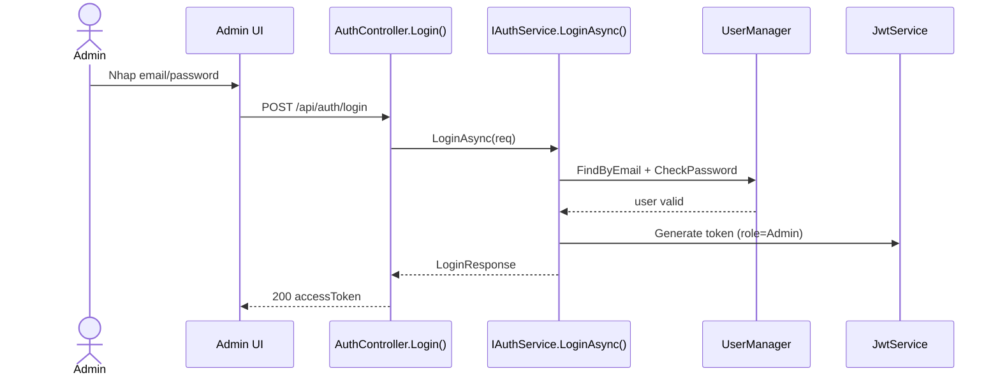

### Activity Diagram
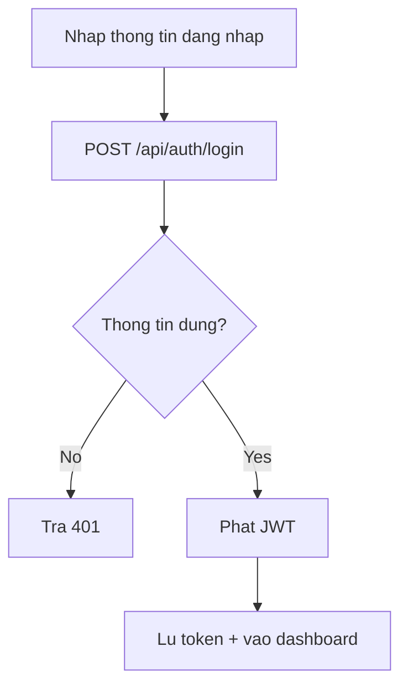

---

## UC-02 - Vendor register

### Sequence Diagram
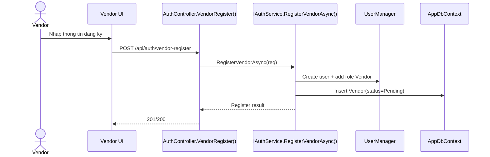

### Activity Diagram
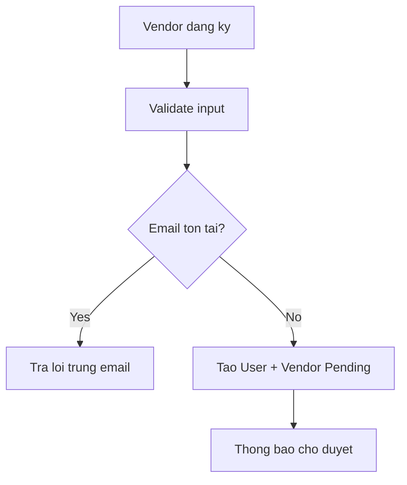

---

## UC-03 - Vendor login

### Sequence Diagram
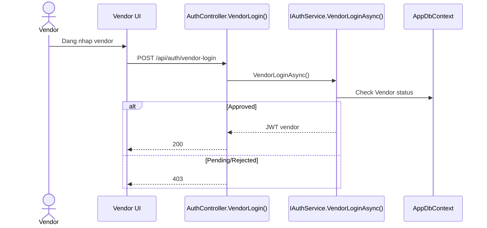

### Activity Diagram
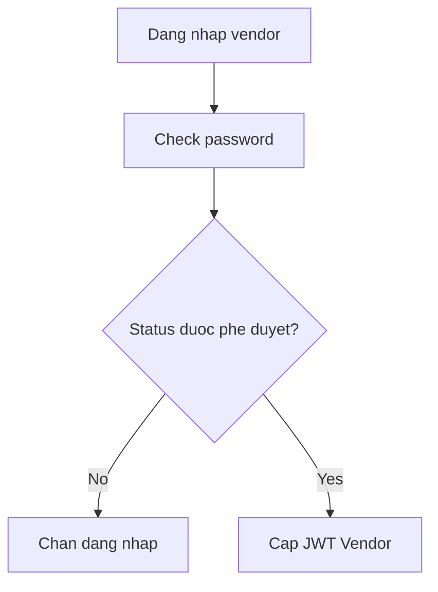

---

## UC-04 - Device register (MAUI)

### Sequence Diagram
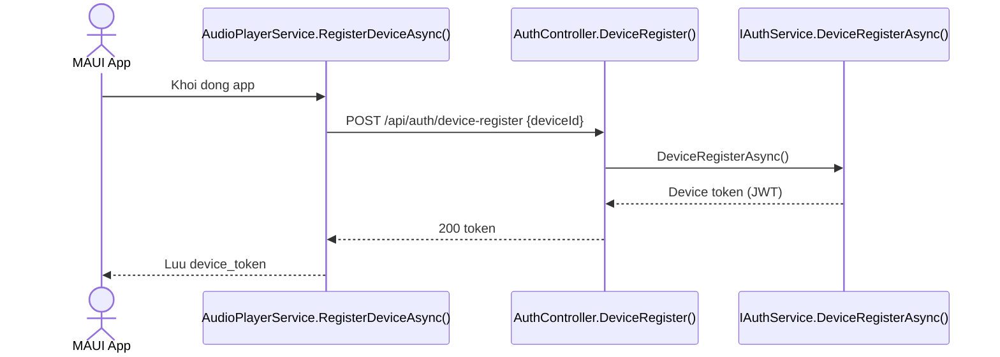

### Activity Diagram
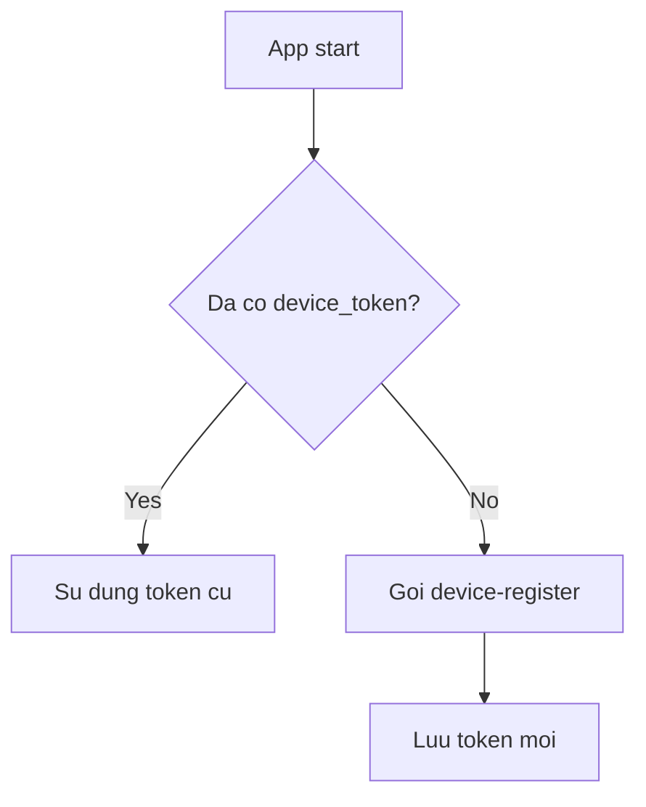

---

## UC-05 - Admin CRUD POI

### Sequence Diagram
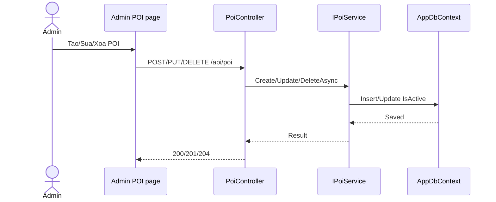

### Activity Diagram
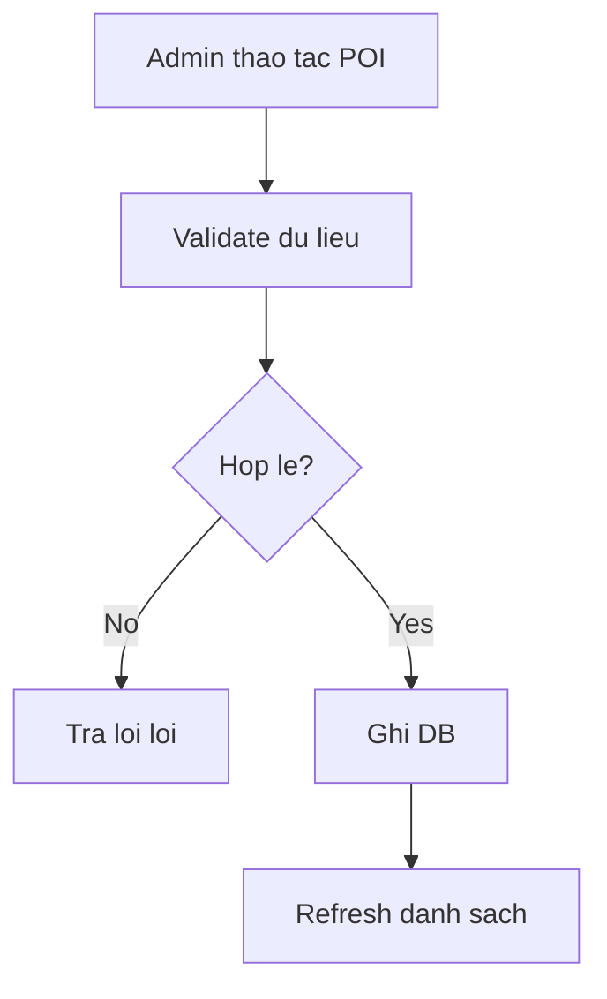

---

## UC-06 - Admin upsert POI script

### Sequence Diagram
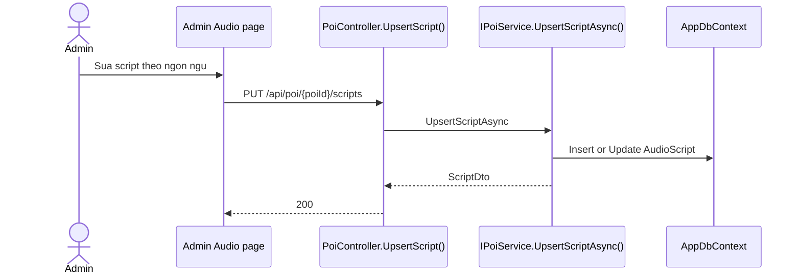

### Activity Diagram
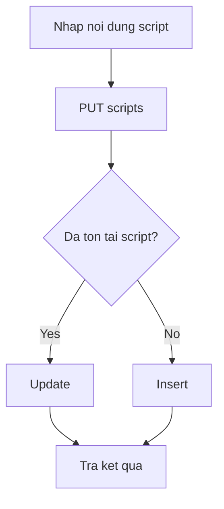

---

## UC-07 - Admin upload/generate audio

### Sequence Diagram
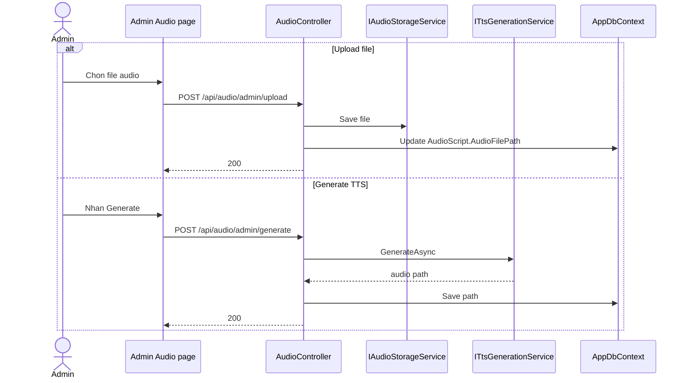

### Activity Diagram
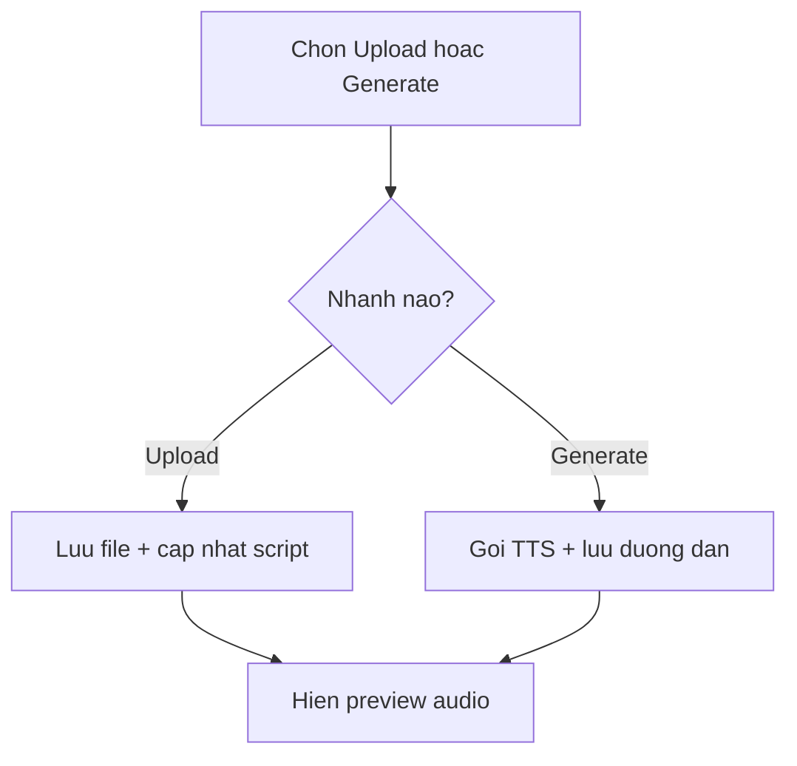

---

## UC-08 - MAUI sync POIs

### Sequence Diagram
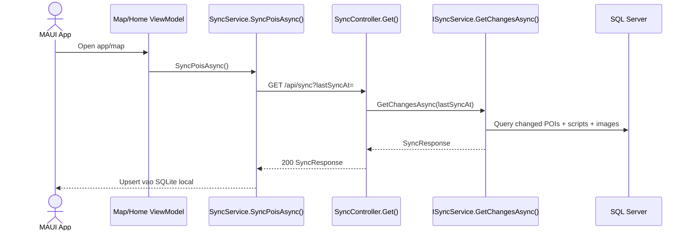

### Activity Diagram
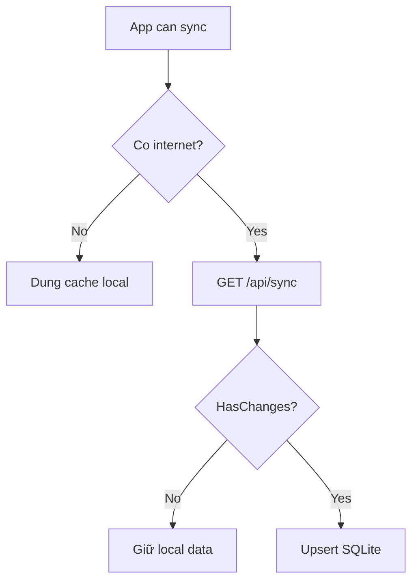

---

## UC-09 - MAUI upload playback logs

### Sequence Diagram
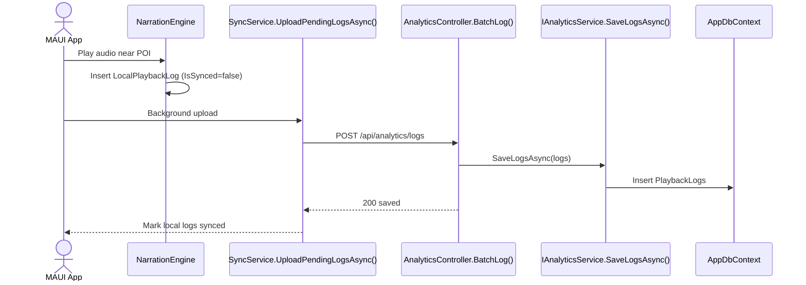

### Activity Diagram
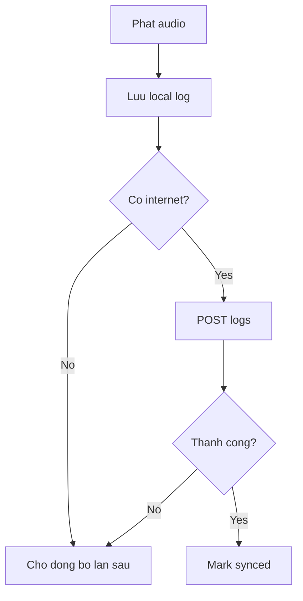

---

## UC-10 - Admin xem analytics

### Sequence Diagram
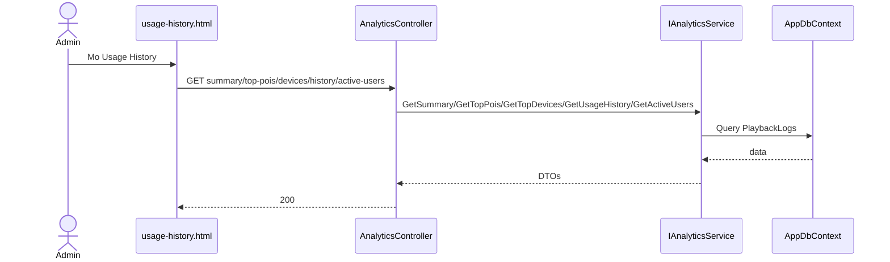

### Activity Diagram
```mermaid
flowchart TD
    A[Mo trang analytics] --> B[Load summary]
    B --> C[Load top devices/pois]
    C --> D[Load history filters]
    D --> E[Render chart + table + active users]
```

---

## UC-11 - Admin tao tour

### Sequence Diagram
```mermaid
sequenceDiagram
    actor Admin
    participant UI as tour.html
    participant TourC as TourController.Create()
    participant TourS as ITourService.CreateAsync()
    participant DB as AppDbContext

    Admin->>UI: Tao tour moi
    UI->>TourC: POST /api/tour
    TourC->>TourS: CreateAsync(request, createdBy)
    TourS->>DB: Insert Tour + TourStops
    TourS-->>TourC: TourDetailDto
    TourC-->>UI: 201
```

### Activity Diagram
```mermaid
flowchart TD
    A[Nhap thong tin tour] --> B[POST /api/tour]
    B --> C{Validate pass?}
    C -- No --> D[Thong bao loi]
    C -- Yes --> E[Tao tour + stops]
    E --> F[Refresh list]
```

---

## UC-12 - Admin reorder tour

### Sequence Diagram
```mermaid
sequenceDiagram
    actor Admin
    participant UI as tour.html
    participant TourC as TourController.Reorder()
    participant TourS as ITourService.ReorderAsync()
    participant DB as AppDbContext

    Admin->>UI: Keo tha POI thu tu moi
    UI->>TourC: PUT /api/tour/{id}/reorder
    TourC->>TourS: ReorderAsync(id, req)
    TourS->>DB: Update TourStops.StopOrder
    TourS-->>TourC: TourDetailDto
    TourC-->>UI: 200
```

### Activity Diagram
```mermaid
flowchart TD
    A[Doi thu tu POI] --> B[PUT reorder]
    B --> C{Danh sach khop?}
    C -- No --> D[Tra 400]
    C -- Yes --> E[Cap nhat StopOrder]
    E --> F[Hien toast thanh cong]
```

---

## UC-13 - Vendor cap nhat profile

### Sequence Diagram
```mermaid
sequenceDiagram
    actor Vendor
    participant UI as vendor profile.html
    participant VC as VendorController.UpdateProfile()
    participant DB as AppDbContext

    Vendor->>UI: Sua business info
    UI->>VC: PUT /api/vendor/profile
    VC->>DB: Update Vendor fields
    VC-->>UI: 200 profile
```

### Activity Diagram
```mermaid
flowchart TD
    A[Sua profile] --> B[PUT profile]
    B --> C{Hop le?}
    C -- No --> D[Hien loi]
    C -- Yes --> E[Luu DB + thong bao]
```

---

## UC-14 - Vendor doi mat khau

### Sequence Diagram
```mermaid
sequenceDiagram
    actor Vendor
    participant UI as vendor profile.html
    participant VC as VendorController.ChangePassword()
    participant UM as UserManager

    Vendor->>UI: Nhap old/new password
    UI->>VC: PUT /api/vendor/change-password
    VC->>UM: ChangePasswordAsync(user, old, new)
    UM-->>VC: result
    VC-->>UI: 200 hoac 400
```

### Activity Diagram
```mermaid
flowchart TD
    A[Nhap mat khau cu/moi] --> B[PUT change-password]
    B --> C{Old password dung?}
    C -- No --> D[Tra loi that bai]
    C -- Yes --> E[Cap nhat mat khau]
```

---

## UC-15 - Vendor gui yeu cau cap nhat POI

### Sequence Diagram
```mermaid
sequenceDiagram
    actor Vendor
    participant UI as vendor upload-images/profile
    participant VC as VendorController.SubmitPoiUpdate()
    participant DB as AppDbContext

    Vendor->>UI: Nhap thong tin cap nhat POI
    UI->>VC: POST /api/vendor/poi/update
    VC->>DB: Insert PendingPOIUpdate(status=Pending)
    VC-->>UI: 200 submitted
```

### Activity Diagram
```mermaid
flowchart TD
    A[Vendor sua de xuat POI] --> B[POST poi/update]
    B --> C[Tao pending record]
    C --> D[Cho admin duyet]
```

---

## UC-16 - Vendor gui staging image/logo

### Sequence Diagram
```mermaid
sequenceDiagram
    actor Vendor
    participant UI as vendor upload-images.html
    participant VC as VendorController
    participant Store as IAudioStorageService
    participant DB as AppDbContext

    alt Image staging
        Vendor->>UI: Upload image
        UI->>VC: POST /api/vendor/images/staging
        VC->>Store: Save temp file
        VC->>DB: Insert StagingImage(Pending)
        VC-->>UI: 200
    else Logo staging
        Vendor->>UI: Upload logo
        UI->>VC: POST /api/vendor/logo/upload
        VC->>Store: Save temp logo
        VC->>DB: Insert StagingImage logo pending
        VC-->>UI: 200
    end
```

### Activity Diagram
```mermaid
flowchart TD
    A[Vendor upload media] --> B[Luu tam]
    B --> C[Tao ban ghi staging Pending]
    C --> D[Hien trang thai cho duyet]
```

---

## UC-17 - Admin duyet/reject pending update + image/logo

### Sequence Diagram
```mermaid
sequenceDiagram
    actor Admin
    participant UI as pending-updates.html / poi.html
    participant AC as AdminVendorController
    participant DB as AppDbContext
    participant Store as Storage

    Admin->>UI: Xem danh sach pending
    UI->>AC: GET pending-updates / staging-images
    AC->>DB: Query pending
    AC-->>UI: items
    Admin->>UI: Approve/Reject
    alt Approve
        UI->>AC: POST approve endpoint
        AC->>DB: Apply du lieu vao PoiPoint/Images/Logo
        AC->>Store: Move temp -> approved (neu can)
        AC-->>UI: 200
    else Reject
        UI->>AC: POST reject endpoint
        AC->>DB: Update status Rejected + note
        AC-->>UI: 200
    end
```

### Activity Diagram
```mermaid
flowchart TD
    A[Admin mo pending list] --> B[Chon item]
    B --> C{Approve hay Reject?}
    C -- Approve --> D[Apply vao data chinh]
    C -- Reject --> E[Danh dau Rejected]
    D --> F[Refresh danh sach]
    E --> F
```

---

## UC-18 - Admin tao invoice + mark paid

### Sequence Diagram
```mermaid
sequenceDiagram
    actor Admin
    participant UI as vendor-payments.html
    participant AC as AdminVendorController
    participant DB as AppDbContext

    Admin->>UI: Tao invoice cho vendor
    UI->>AC: POST /api/admin/payments
    AC->>DB: Insert VendorPayment(status=Unpaid)
    AC-->>UI: 201
    Admin->>UI: Nhan "Da thanh toan"
    UI->>AC: PUT /api/admin/payments/{id}/status
    AC->>DB: Update status=Paid
    AC-->>UI: 200
```

### Activity Diagram
```mermaid
flowchart TD
    A[Tao invoice] --> B[Status Unpaid]
    B --> C[Vendor submit proof]
    C --> D[Admin verify]
    D --> E[Set Paid]
```

---

## UC-19 - Vendor submit payment proof

### Sequence Diagram
```mermaid
sequenceDiagram
    actor Vendor
    participant UI as vendor profile.html
    participant VC as VendorController.SubmitPayment()
    participant Store as Storage
    participant DB as AppDbContext

    Vendor->>UI: Chon invoice + upload bien lai
    UI->>VC: POST /api/vendor/payments/submit
    VC->>Store: Save receipt
    VC->>DB: Update VendorPayment(status=PendingVerification)
    VC-->>UI: 200
```

### Activity Diagram
```mermaid
flowchart TD
    A[Vendor chon invoice] --> B[Nhap thong tin giao dich]
    B --> C[Upload receipt]
    C --> D[Submit payment]
    D --> E[Status PendingVerification]
    E --> F[Cho admin mark Paid]
```

